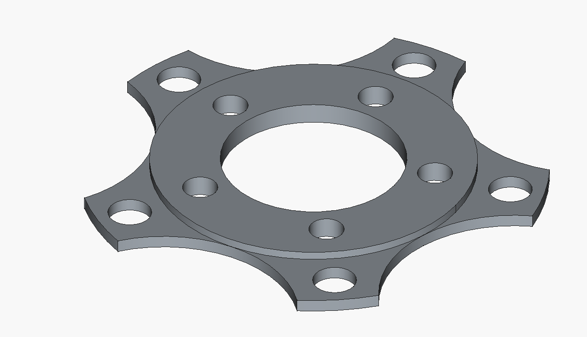
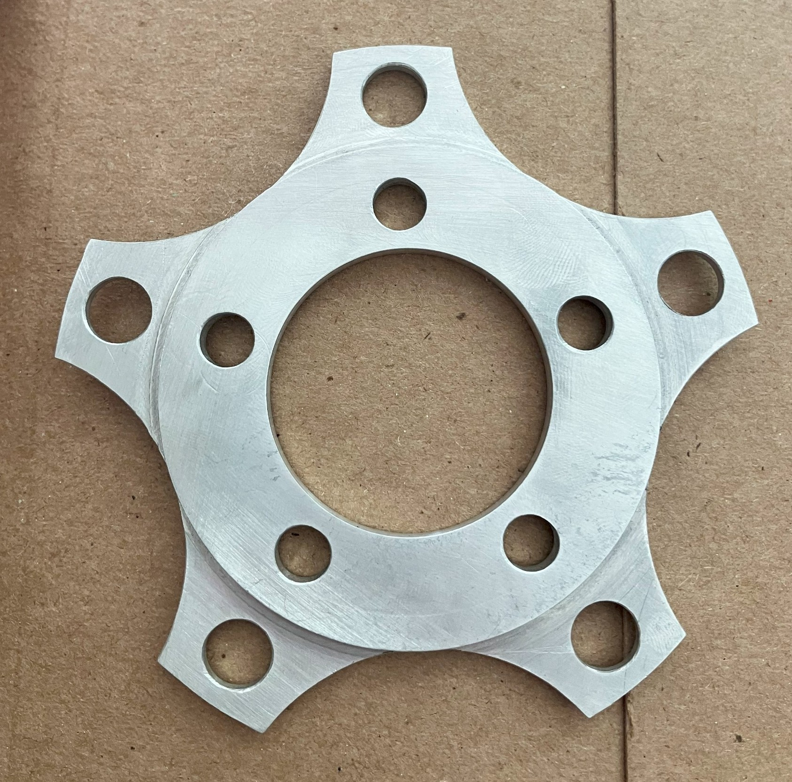
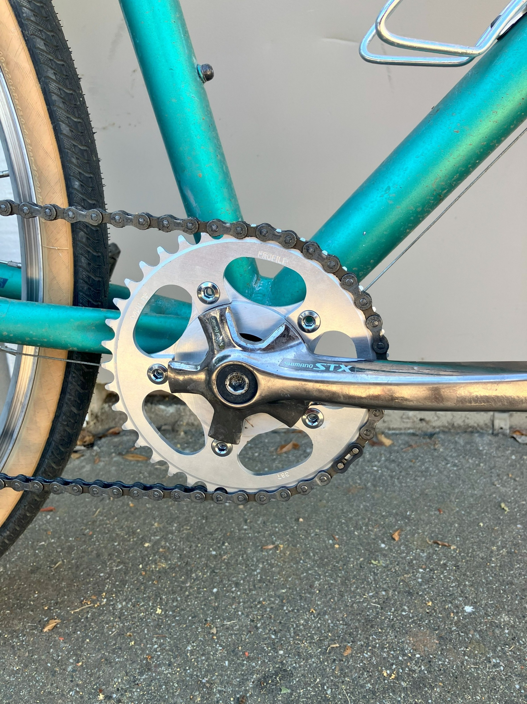

# 58mm Shimano STX crankset adapter

The Shimano STX cranks of yore had a unique chainring bolt circle of 58mm. This is incompatible with almost all modern chainrings.

Attached is an adapter I designed to convert the STX cranks into a 1x chainset with a 94mm BCD. There is a beauty in conforming old but usable bike parts to be compatible with the modern world.

You can have this machined from PCBWay/CraftCloud etc.

## Results

I had mine machined out of 6061 aluminium for ~\$30 off CraftCloud.

